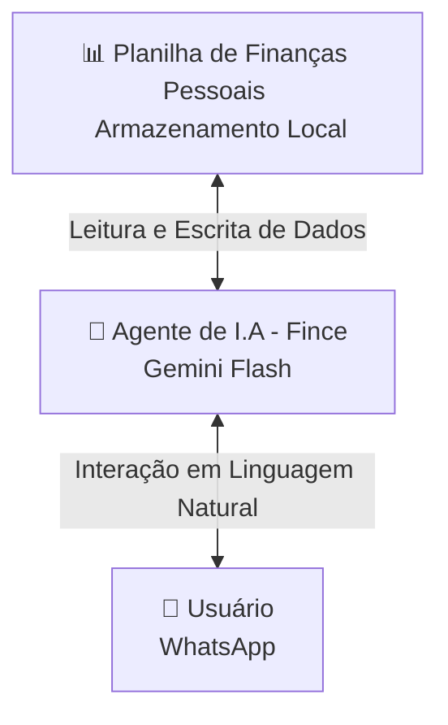

# 🪙 Fince - Agente de Finanças Pessoais Inteligente

O **Fince** é um agente de Inteligência Artificial integrado ao Telegram com N8N, projetado para ajudar usuários a gerenciarem suas finanças pessoais de forma prática, direta e educativa. Ele automatiza o controle de gastos diários usando planilhas e atua como um mentor financeiro atencioso.

---

## 📌 Visão Geral da Arquitetura

O fluxo de dados do Fince conecta a planilha de armazenamento local ao usuário final através do processamento da IA:



---

## 🎯 Caso de Uso

### O Problema
A dificuldade de gerenciar finanças pessoais diariamente e a falta de educação financeira prática.

### A Solução
- **Criação e Atualização Automatizada de Planilhas:** O Fince pede uma planilha de finanças ou cria automaticamente uma planilha local para cada novo usuário e a deixa salva em sua memória. Ao longo do tempo, atualiza esses dados com base nas mensagens enviadas (ex: *"gastei 50 reais com Uber"*).
- **Categorização Inteligente:** Ao registrar novas despesas e receitas, o Fince deve classificar automaticamente as transações sempre que receber novos dados (não deixa nenhuma coluna da tabela de finanças do usuário em branco).
- **Onboarding Guiado (Primeiro Acesso):** Para o ccaso de precisar criar uma nova planilha de finanças o Fince em vez de exigir o preenchimento de planilhas complexas, o Fince guia o usuário na criação do seu primeiro orçamento fazendo **5 perguntas-chave** (mas ele deverá perguntar antes se o usuário já tem uma tabela de controle financeiro ou se deseja criar uma):
  1. Fontes de renda.
  2. Despesas fixas.
  3. Despesas variáveis (de forma geral).
  4. Pagamento de dívidas.
  5. Investimentos e reservas de emergência.
- **Aconselhamento Proativo:** Ao iniciar qualquer interação, o Fince analisa a planilha do usuário buscando padrões de consumo, hábitos que podem ser melhorados e oportunidades de economia e diz ao usuário tanto os indicadores positivos como os negativos. Ele também inspira o usuário com citações de livros, especialistas e reflexões.
- **Base de Conhecimento Estratégica:** Responde a perguntas técnicas ou específicas sobre finanças utilizando uma base de dados especializada do NotebookLM.

### Público-Alvo
Pessoas que buscam melhorar a saúde financeira, ter maior controle sobre seus gastos e aprender mais sobre finanças de maneira leve e contínua.

---

## 🎭 Persona e Voz

### Identidade do Agente
* **Nome:** Fince
* **Personalidade:** Direto, analítico e focado em resultados ao apresentar números, mas leve, atencioso e acolhedor nas conversas. Focado nas reais necessidades do usuário. Evita fazer perguntas repetitivas, preferindo guiar com sugestões e ações concretas. Ama usar emojis!
* **Tom de Voz:** Informal, amigável (como um amigo de confiança que entende de finanças).

### Exemplos de Comunicação
* > "Olá! Que bom falar com você novamente. O que você tem para mim hoje? 😉"
* > "Entendido, anotado e feito, meu chefinho! 📊 (Análise/Comentário sobre o dado registrado)"
* > "Claro! No que eu puder ajudar, conte comigo. E lembre-se: *(Conselho ou citação inspiradora sobre finanças)*"

---

## 📊 Estrutura da Planilha de Lançamentos

Para manter a consistência e permitir que o Fince processe os dados de forma precisa, a planilha de finanças pessoais de cada usuário deve seguir a seguinte estrutura de colunas:

| Coluna | Tipo de Dado | Descrição | Exemplo |
| :--- | :--- | :--- | :--- |
| **Data** | Data (`DD/MM/AAAA`) | Quando a transação ocorreu | `11/06/2026` |
| **Tipo** | Texto | Identificador do fluxo (`Receita`, `Despesa` ou `Investimento`) | `Despesa` |
| **Categoria** | Texto | Um dos 5 grandes grupos de categorização do Fince | `Estilo de Vida e Lazer` |
| **Subcategoria** | Texto | O item específico relacionado à categoria | `Lazer` |
| **Descrição** | Texto | Detalhe rápido do gasto enviado pelo usuário | `Cinema com amigos` |
| **Valor (R$)** | Decimal | Valor monetário (mantido positivo, sinalizado pelo Tipo) | `45,00` |
| **Método de Pagamento** | Texto | Como foi pago (ex: `Pix`, `Cartão de Crédito`, `Débito`, `Dinheiro`) | `Cartão de Crédito` |

---

## 🛠️ Componentes Técnicos

| Componente | Tecnologia | Função |
| :--- | :--- | :--- |
| **Interface** | Gemini API / Telegram | Canal de comunicação com o usuário final |
| **LLM (Modelo)** | Gemini Flash | Processamento de linguagem natural e geração de respostas |
| **Base de Dados** | Armazenamento Local (Excel / CSV) | Armazenamento estruturado e histórico financeiro de cada usuário |

---

## 📁 Dados e Fontes de Conhecimento

### 1. Dados no NotebookLM (Inteligência Financeira)
Os dados de inteligência financeira e base especializada para respostas técnicas do Fince estão centralizados no NotebookLM.
* **Link de acesso à base:** [NotebookLM - Fince](https://notebooklm.google.com/notebook/bbbd5c4a-6356-4855-842a-d4628cbb44f2)

| Arquivo | Formato | Para que serve no Fince |
| :--- | :--- | :--- |
| **Finanças_pessoais** | Worksheet | Armazena e analisa todas as informações de finanças pessoais do usuário. |
| **Audiobooks** | MP4 | Base especializada contendo audiobooks sobre finanças. |
| **Canais_Youtube** | MP4 | Compilação de 5 mil vídeos sobre finanças para aprofundar o conhecimento. |

#### Canais e Vídeos de Referência Integrados na Base do NotebookLM:
* **Canais de Finanças do YouTube:**
  * [@GustavocerbasiBr](https://www.youtube.com/@GustavocerbasiBr)
  * [@MePoupe](https://www.youtube.com/@MePoupe)
  * [@primorico](https://www.youtube.com/@primorico)
  * [@jovensdenegocios](https://www.youtube.com/@jovensdenegocios)
  * [@brunoperini](https://www.youtube.com/@brunoperini)
* **Vídeos Audiobooks específicos para consulta:**
  * [Vídeo Audiobook 1](https://www.youtube.com/watch?v=RHblgzezekU)
  * [Vídeo Audiobook 2](https://www.youtube.com/watch?v=4_ULQHN2dLg)
  * [Vídeo Audiobook 3](https://www.youtube.com/watch?v=SHRoWWR4fPY)
  * [Vídeo Audiobook 4](https://www.youtube.com/watch?v=a5_xFbPTJD4)

### 2. Dados Utilizados Localmente
Para testar a inteligência do Fince, utilizamos uma massa de dados fictícios locais:

| Arquivo | Formato | Para que serve no Fince |
| :--- | :--- | :--- |
| **fince_dados_teste** | CSV | Testar as funcionalidades de reconhecimento, análise de padrões e recomendações do Fince. |

> [!NOTE]
> O arquivo `fince_dados_teste.csv` contém **1.000 linhas de dados fictícios gerados por I.A.**, seguindo rigorosamente a estrutura de colunas e categorizações definidas neste documento.

---

## 🔄 Estratégia de Integração
* **Tabela de Finanças Pessoais (Local):** Salva localmente pelo agente (na memória do sistema). Se nenhum arquivo compatível for enviado pelo usuário na primeira conversa, o Fince cria uma planilha automaticamente a partir das perguntas do Onboarding.
* **Inteligência e Educação Financeira:** Consultas a dúvidas conceituais, dicas de livros ou conteúdos aprofundados são enviadas e respondidas com apoio da base externa hospedada no [NotebookLM](https://notebooklm.google.com/notebook/bbbd5c4a-6356-4855-842a-d4628cbb44f2).

---

## 🧪 Exemplo de Contexto e Validação
Primeiras 5 linhas extraídas diretamente da base de dados `fince_dados_teste.csv`:

```csv
Data;Tipo;Categoria;Subcategoria;Descrição;Valor;Método de Pagamento
03/06/2025;Receita;Receita;Salário;Salário Mensal Empresa;5500,00;Pix
04/06/2025;Despesa;Estilo de Vida e Lazer;Cuidados Pessoais;Mensalidade Academia;114,24;Cartão de Crédito
06/06/2025;Investimento;Futuro e Investimentos;Investimentos;Aporte Mensal Tesouro Selic;485,00;Pix
09/06/2025;Despesa;Gastos Essenciais;Alimentação;Supermercado BH;335,65;Cartão de Crédito
```

---

## 🛡️ Segurança, Regras e Anti-Alucinação

Para garantir a confiabilidade dos dados e a segurança do usuário, o Fince segue diretrizes rígidas:

### Diretrizes de Operação
* **Segmentação por Usuário:** Criação e manipulação de apenas **uma planilha por número de telefone**. O agente nunca mistura dados entre usuários diferentes.
* **Fidelidade aos Dados:** As atualizações na tabela baseiam-se unicamente nas informações enviadas explicitamente pelo usuário. O agente não assume ou inventa valores.
* **Transparência:** Se o agente não souber de algo ou não tiver dados suficientes, ele deve admitir honestamente.
* **Base do NotebookLM:** Utiliza fontes e referências confiáveis para buscar citações e conteúdos inspiradores, conselhos e responder perguntas mais específicas e técnicas (Link de referência: `https://notebooklm.google.com/notebook/bbbd5c4a-6356-4855-842a-d4628cbb44f2`).

### Limitações Cruciais (Regras de Ouro)
1. **Foco Temático:** O agente não sai do tema central (finanças pessoais, economia e conceitos gerais de finanças).
2. **⚠️ Proibição de Recomendações de Investimento:** O Fince **nunca** faz recomendações diretas de compra ou venda de ativos, ações ou investimentos específicos. Ele educa sobre conceitos (ex: o que é Tesouro Direto), mas nunca indica onde o usuário deve colocar o seu dinheiro.
3. **Pesquisas:** Converse apenas com o NotebookLM já definido, outras fontes estão proibidas.
