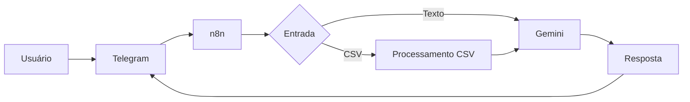

# 🪙 Fince - Mentor Financeiro Inteligente

O **Fince** é um agente de Inteligência Artificial focado em **educação financeira e gestão de finanças pessoais**, desenvolvido para ajudar usuários a organizar suas finanças, analisar gastos, criar hábitos financeiros saudáveis e aprender sobre economia de forma simples e prática.

📱 Acesse pelo Telegram: **@FinceAgent_Bot**

---

# 🚀 Visão Geral

O Fince utiliza **Google Gemini**, **n8n**, **Telegram** e **NotebookLM** para oferecer uma experiência personalizada de acompanhamento financeiro.

### Principais Funcionalidades

* 📊 Análise de planilhas financeiras (CSV)
* 💬 Conversação natural sobre finanças pessoais
* 🎯 Onboarding guiado para quem ainda não possui controle financeiro
* 📈 Identificação de padrões de gastos e oportunidades de economia
* 📚 Educação financeira baseada em conteúdo especializado
* 💡 Insights e feedbacks personalizados
* 🤝 Acompanhamento contínuo da evolução financeira do usuário

---

# 🏗️ Arquitetura

---

# 🎯 Objetivo

Muitas pessoas desejam controlar melhor suas finanças, mas não sabem por onde começar.

O Fince atua como um mentor financeiro digital, auxiliando o usuário desde a criação da primeira planilha financeira até análises mais avançadas sobre gastos, receitas e investimentos.

---

# 📊 Estrutura Padrão dos Dados

As análises do Fince utilizam o seguinte padrão:

| Campo               | Exemplo                          |
| ------------------- | -------------------------------- |
| Data                | 11/06/2026                       |
| Tipo                | Receita, Despesa ou Investimento |
| Categoria           | Gastos Essenciais                |
| Subcategoria        | Alimentação                      |
| Descrição           | Supermercado                     |
| Valor               | 150,00                           |
| Método de Pagamento | Pix                              |

> O formato recomendado é **CSV com delimitador ";"**.

---

# 🧠 Como o Fince Funciona

### 📊 Usuários com Controle Financeiro

* Enviam uma planilha CSV de finanças pessoais.
* O Fince padroniza os dados para seu formato padrão.
* Realiza análises financeiras e identifica padrões de gastos.
* Gera indicadores, insights e oportunidades de melhoria.
* Acompanha a evolução financeira ao longo do tempo.

### 📝 Usuários sem Controle Financeiro

O Fince inicia um onboarding guiado com 5 perguntas essenciais:

1. Fontes de renda
2. Despesas fixas
3. Despesas variáveis
4. Dívidas
5. Investimentos e reserva de emergência

Com essas informações, o sistema ajuda o usuário a criar sua primeira estrutura de controle financeiro.

### 📚 Usuários que Desejam Aprender Finanças

* Podem fazer perguntas sobre educação financeira em linguagem natural.
* O Fince explica conceitos de forma simples e didática.
* Utiliza uma base de conhecimento especializada hospedada no NotebookLM.
* Compartilha exemplos, reflexões e ensinamentos de especialistas reconhecidos.
* Auxilia na construção gradual do conhecimento financeiro, desde conceitos básicos até temas mais avançados.

> O Fince não realiza recomendações de investimento. Seu papel é educar, orientar e ajudar o usuário a desenvolver autonomia financeira.

---

# 📚 Base de Conhecimento

Todo o conteúdo educacional utilizado pelo Fince é consultado exclusivamente através do **NotebookLM**, contendo:

* Audiobooks de finanças
* Conteúdo de especialistas brasileiros
* Mais de 5 mil vídeos sobre educação financeira

O objetivo é garantir respostas mais confiáveis e alinhadas às fontes definidas pelo projeto.

---

# 🛠️ Tecnologias Utilizadas

| Componente        | Tecnologia          |
| ----------------- | ------------------- |
| IA Generativa     | Google Gemini Flash |
| Automação         | n8n                 |
| Interface         | Telegram            |
| Conhecimento      | NotebookLM          |
| Dados Financeiros | CSV / Excel         |

---

# 🛡️ Segurança e Regras

O Fince segue princípios rigorosos:

* 🔒 Não compartilha dados entre usuários.
* 📊 Analisa apenas informações fornecidas pelo usuário.
* 🚫 Não realiza recomendações de investimentos.
* 📚 Utiliza exclusivamente a base do NotebookLM para ensino financeiro.
* ✅ Assume quando não possui informações suficientes para responder.

---

# 📈 Avaliação do Agente

Foram realizados testes de:

* Assertividade
* Segurança
* Coerência

### Resultados

| Teste                        | Status |
| ---------------------------- | ------ |
| Consulta de Gastos           | ✅      |
| Plano de Estudos Financeiros | ✅      |
| Perguntas Fora do Escopo     | ✅      |
| Proteção de Dados Sensíveis  | ✅      |

**Taxa de sucesso: 100% (4/4 testes aprovados)**

---

# ✨ Diferenciais

* Educação financeira personalizada
* Aprendizado baseado nos dados do usuário
* Integração com conteúdo especializado
* Feedbacks contínuos sobre hábitos financeiros
* Criação automática de controle financeiro para iniciantes

---

# 📌 Conclusão

O **Fince** combina Inteligência Artificial, automação e educação financeira para ajudar usuários a desenvolverem melhores hábitos financeiros, organizarem suas finanças e tomarem decisões mais conscientes ao longo do tempo.
